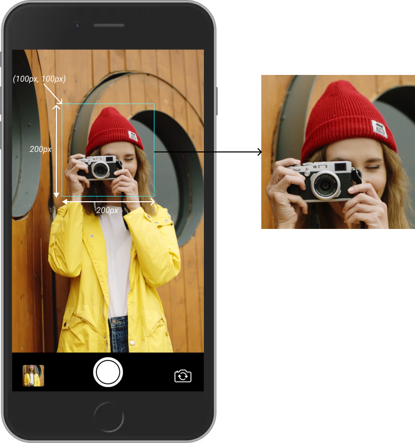

# Changelog
All notable changes to this project will be documented in this file.


facing=>facingMode
tookphoto=>captured


camera.on('captured', event => {
  console.log(event.detail.capture);// data:image/png;base64,iVB...
  <!-- console.log(event.detail.base64);// data:image/png;base64,iVB... -->
});


## [1.0.4] - 2021/8/23
### Fixed
- Captures can now be cropped within a specified range.


Crop an image 200px wide and 200px high from coordinates (100px, 100px) based on the upper left corner.
```js
const capture = camera.capture({extract: {x: 100, y: 100, width: 200, height: 200}});
```

Resize the cropped result by 100px width and 100px height
```js
const capture = camera.capture({width: 100, height: 100, extract: {x: 100, y: 100, width: 200, height: 200}});
```

## [1.0.3] - 2020/9/23
### Fixed
- Fixed a bug where the camera component would not change to a relative position if it was in a static position.

## [1.0.2] - 2020/8/26
### Fixed
- Added API.md to NPM package.

## [1.0.1] - 2020/8/26
### Fixed
- Added API.md and CHANGELOG.md.

## [1.0.0] - 2020/8/25
### Fixed
- Released.

[1.0.1]: https://github.com/takuya-motoshima/js-camera/compare/v1.0.0...v1.0.1
[1.0.2]: https://github.com/takuya-motoshima/js-camera/compare/v1.0.1...v1.0.2
[1.0.3]: https://github.com/takuya-motoshima/js-camera/compare/v1.0.2...v1.0.3
[1.0.4]: https://github.com/takuya-motoshima/js-camera/compare/v1.0.3...v1.0.4