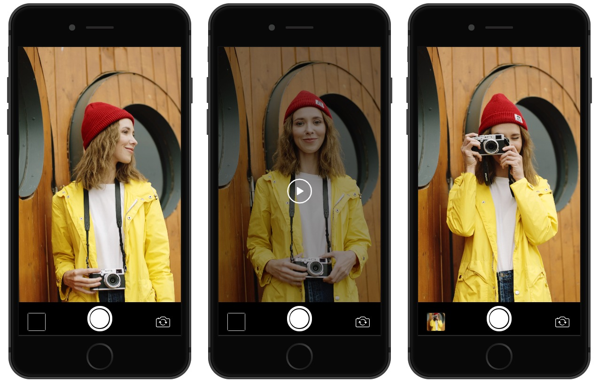
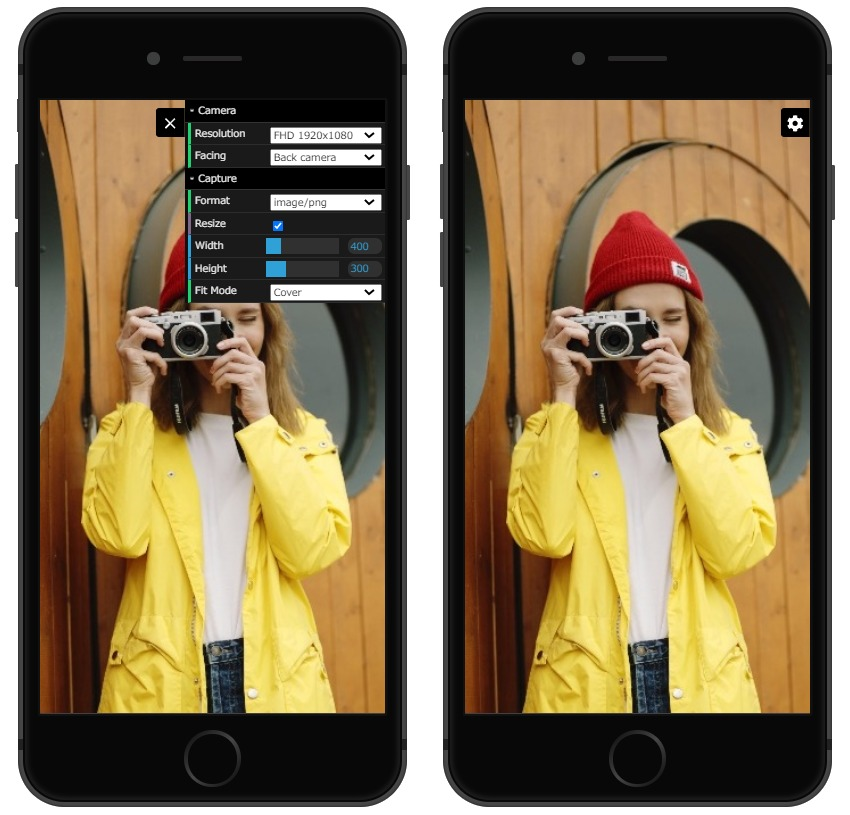

# js-camera
This is a custom element V1-based camera component.

## Installation
```sh
npm install js-camera;
```

## API
[API Documentation](./API.md)

## Usage
### Use Camera Controls
You can use play, pause, capture and camera face switch immediately by using "controls" attribute on camera element.



Add "controls" and "autoplay" attributes to the camera element.  
If necessary, specify the camera face with the "facing" attribute and the resolution with the "width" and "height" attributes.  
The default for the "facing" attribute is "back". If omitted, the rear camera opens.

```html
<js-camera id="camera" controls autoplay facing="back" width="1920" height="1080"></js-camera>
```

You can receive the photos taken at the event and send them to the server.  
Also use the play and pause events if needed.  

```js
import 'js-camera';

// Camera element
const camera = document.querySelector('#camera');

// If you use the "autoplay" attribute to automatically open camera, you can wait for the camera to fully open if necessary.
await camera.waitOpen();

// Camera event listener
camera
  // Called after opening the camera
  .on('opened', () => {})
  // Called after playing the camera from pause/
  .on('played', () => {})
  // Called after pausing the camera
  .on('paused', () => {})
  // Returns the photo taken from the shoot button on the camera controller
  // The captured image can be received from "event.detail.dat" in data URL.
  .on('captured', event => {
    console.log(event.detail.capture.slice(0, 30));
  });
```

### Try camera options
If you want to experiment with different camera options, you can use "dat-gui" for the camera element and use the options menu.



The current GUI options can be accessed from the camera element "guiState".  
Here is an example using the GUI option.

Add "dat-gui" attribute to the camera element.

```html
<js-camera id="camera" dat-gui></js-camera>
```

Get camera elements with JS and operate GUI options.

```js

import 'js-camera';

// Camera element
const camera = document.querySelector('#camera');

// Open camera
const [width, height] = camera.guiState.resolution.split(',');
await camera.open(camera.guiState.facing, width, height);

// Close camera
camera.close();

// Take a photo
const options = {format: camera.guiState.format};// Capture options
if (camera.guiState.resize) {
  options.width = camera.guiState.width;
  options.height = camera.guiState.height;
  options.fit = camera.guiState.fit;
}
const capture = camera.capture(options);
console.log(capture);

// Pause
camera.pause();

// Resume from pause
camera.play();
```

### Basic camera usage.
Place the camera open/close, play, pause, and capture buttons in the HTML.

```html
<style>
.actions {
  position: absolute;
  z-index: 1002;
  left: 0;
  bottom: 0;
  padding: 10px;
  width: 100%;
  text-align: center;
}
</style>

<js-camera id="camera"></js-camera>

<div class="actions">
  <button id="openButton" type="button">Open</button>
  <button id="closeButton" type="button">Close</button>
  <button id="pauseButton" type="button">Pause</button>
  <button id="playButton" type="button">Play</button>
  <button id="captureButton" type="button">Capture</button>
</div>
```

Implements camera opening, closing, playing, pausing, and button event capture.  
This is the easiest way to use the camera.

```js
import 'js-camera';

// Camera element
const camera = document.querySelector('#camera');

// Open camera.
// If necessary, you can also specify the resolution like "await camera.open('back', 1920, 1080)".
document.querySelector('#openButton').addEventListener('click', async () => {
  await camera.open('back');
});

// Close  camera.
document.querySelector('#closeButton').addEventListener('click', () => {
  if (!camera.opened)
    return;
  camera.close();
});

// Pause
document.querySelector('#pauseButton').addEventListener('click', () => {
  if (!camera.opened)
    return;
  camera.pause();
});

// Play camera
document.querySelector('#playButton').addEventListener('click', () => {
  if (!camera.opened)
    return;
  camera.play();
});

// Take a photo
document.querySelector('#captureButton').addEventListener('click', () => {
  if (!camera.opened)
    return;
  // Get capture data URL.
  let capture = camera.capture();
  console.log(`Capture: ${capture}`);// Capture: data:image/png;base64,iVBORw0K

  // You can specify image/webp, image/png, image/jpeg as the capture format.
  // Default is image/png.
  capture = camera.capture({format: 'image/webp'});
  console.log(`WebP capture: ${capture}`);// WebP capture: data:image/webp;base64,UklGRrb

  // You can also resize the capture with width, height, and fit options.
  capture = camera.capture({
    fit: 'cover',
    width: 300,
    height: 200
  });
  console.log(`Resize capture: ${capture}`);// Resize capture: data:image/png;base64,iVBORw0K
});
```

## Release Notes
All changes can be found [here](CHANGELOG.md).

## Author
**Takuya Motoshima**

* [github/takuya-motoshima](https://github.com/takuya-motoshima)
* [twitter/TakuyaMotoshima](https://twitter.com/TakuyaMotoshima)
* [facebook/takuya.motoshima.7](https://www.facebook.com/takuya.motoshima.7)

## License
[MIT](LICENSE)